# Docker CI/CD Setup Guide

This guide explains how to set up automated Docker image building and pushing using GitHub Actions for your Finance AI Mockup application.

## Overview

A two-stage CI/CD pipeline has been created with these GitHub Actions workflows:

**Stage 1 - Testing (Always runs first):**
- **`docker-test.yml`** - Tests docker-compose build and runs health checks

**Stage 2 - Build & Push (Only runs after tests pass):**
- **`docker-build-push.yml`** - Builds and pushes to Docker Hub

This ensures your application is working properly before pushing images to the registry.

## Pipeline Flow

```mermaid
graph TD
    A["🔄 Code Push/PR"] --> B["📋 Docker Compose Test"]
    
    B --> C{{"🧪 Build & Test<br/>docker-compose.yml"}}
    C --> D{{"🏥 Health Checks<br/>Backend: /health<br/>Frontend: /"}}
    D --> E{{"🔄 Resilience Tests<br/>Service Restart<br/>Resource Check"}}
    E --> F{{"🧪 Integration Tests<br/>Auth Endpoints<br/>API Validation"}}
    
    F --> G{{"✅ Tests Pass?"}}
    G -->|"❌ Fail"| H["🚫 Stop Pipeline<br/>Show Logs"]
    G -->|"✅ Pass"| I["🏗️ Build & Push Images"]
    
    I --> J{{"🐳 Multi-Platform Build<br/>AMD64 + ARM64"}}
    J --> K{{"📤 Push to Registry<br/>Docker Hub"}}
    K --> L{{"🚀 Deploy Staging<br/>(main branch)"}}
    L --> M{{"🎯 Deploy Production<br/>(version tags)"}}
    
    style A fill:#e1f5fe
    style B fill:#f3e5f5
    style G fill:#fff3e0
    style H fill:#ffebee
    style I fill:#e8f5e8
    style L fill:#fff8e1
    style M fill:#e3f2fd
```



## Quick Setup

### Using Docker Hub

1. **Create Docker Hub account** at [hub.docker.com](https://hub.docker.com)

2. **Add GitHub Secrets**:
   - Go to your GitHub repository → Settings → Secrets and variables → Actions
   - Add these secrets:
     ```
     DOCKER_USERNAME: your-dockerhub-username
     DOCKER_PASSWORD: your-dockerhub-password-or-token
     ```

3. **Enable the workflow**:
   - Keep `.github/workflows/docker-build-push.yml`

## How It Works

### Pipeline Structure

**Stage 1: Docker Compose Test (`docker-test.yml`)**
- Triggers on: Push to `main`, Pull requests, or changes to Docker files
- Builds services using `docker-compose build`
- Starts services and waits for them to be ready
- Runs comprehensive health checks on all endpoints
- Tests service restart resilience
- Runs integration tests (for PRs)

**Stage 2: Build & Push (`docker-build-push.yml`)**
- Triggers only AFTER Stage 1 completes successfully
- Builds optimized multi-platform images
- Pushes to Docker Hub registry
- Deploys to staging/production environments

### Triggers

- **Push to `main` branch**: 
  1. Runs docker-compose tests ✅
  2. If tests pass → Builds and pushes images tagged as `latest` and `main`
- **Git tags** (e.g., `v1.0.0`): Directly builds and pushes images with version tags
- **Pull requests**: Only runs docker-compose tests (doesn't push images)

### Images Created

For each trigger, two images are built:

1. **Backend**: `{registry}/{repo-name}-backend`
2. **Frontend**: `{registry}/{repo-name}-frontend`

### Image Tags

Images are tagged with:
- `latest` (for main branch)
- `main` (for main branch)
- `v1.0.0`, `v1.0`, `v1` (for version tags)
- `main-abc1234` (branch + commit SHA)

## Testing Pipeline Details

The `docker-test.yml` workflow performs comprehensive testing:

### 🏗️ **Build Testing**
- Builds all services using your existing `docker-compose.yml`
- Tests with clean builds (no cache) to catch dependency issues
- Verifies both frontend and backend containers start successfully

### 🔍 **Health Checks**
- **Backend**: Tests `/health` endpoint returns 200
- **Frontend**: Verifies main page loads successfully
- **API Endpoints**: Tests available API routes (profits, charts, etc.)
- **Cross-Service**: Validates services can communicate within Docker network

### 🔄 **Resilience Testing**
- **Service Restart**: Tests backend recovery after restart
- **Resource Monitoring**: Checks CPU and memory usage
- **Network Connectivity**: Validates internal Docker networking

### 🧪 **Integration Tests**
- Runs existing test files (`test_auth_endpoints.py`)
- Tests end-to-end workflows
- Validates authentication endpoints

### 📊 **Failure Debugging**
- Automatically shows container logs on failure
- Displays container status and resource usage
- Provides detailed error messages

## Using the Images

### With Docker Compose

Create a production `docker-compose.prod.yml`:

```yaml
version: '3.8'

services:
  backend:
    image: {your-registry}/{your-repo}-backend:latest
    environment:
      SECRET_KEY: "${SECRET_KEY}"
      DATABASE_URL: "${DATABASE_URL}"
      ALLOWED_ORIGINS: "${ALLOWED_ORIGINS}"
    ports:
      - "8000:8000"
    networks:
      - finance-ai-network

  frontend:
    image: {your-registry}/{your-repo}-frontend:latest
    ports:
      - "3000:80"
    depends_on:
      - backend
    networks:
      - finance-ai-network

networks:
  finance-ai-network:
    driver: bridge
```

### With Docker CLI

```bash
# Pull and run backend
docker pull {your-registry}/{your-repo}-backend:latest
docker run -d -p 8000:8000 \
  -e SECRET_KEY="your-secret" \
  -e DATABASE_URL="sqlite:///:memory:" \
  {your-registry}/{your-repo}-backend:latest

# Pull and run frontend
docker pull {your-registry}/{your-repo}-frontend:latest
docker run -d -p 3000:80 {your-registry}/{your-repo}-frontend:latest
```

### With Kubernetes

```yaml
apiVersion: apps/v1
kind: Deployment
metadata:
  name: finance-ai-backend
spec:
  replicas: 2
  selector:
    matchLabels:
      app: finance-ai-backend
  template:
    metadata:
      labels:
        app: finance-ai-backend
    spec:
      containers:
      - name: backend
        image: {your-registry}/{your-repo}-backend:latest
        ports:
        - containerPort: 8000
        env:
        - name: SECRET_KEY
          valueFrom:
            secretKeyRef:
              name: finance-ai-secrets
              key: secret-key
---
apiVersion: apps/v1
kind: Deployment
metadata:
  name: finance-ai-frontend
spec:
  replicas: 2
  selector:
    matchLabels:
      app: finance-ai-frontend
  template:
    metadata:
      labels:
        app: finance-ai-frontend
    spec:
      containers:
      - name: frontend
        image: {your-registry}/{your-repo}-frontend:latest
        ports:
        - containerPort: 80
```

## Deployment Automation

The workflows include placeholder deployment jobs that trigger:

- **Staging**: Automatically deploys `main` branch builds
- **Production**: Automatically deploys tagged releases

### Setting Up Environments

1. **Create GitHub Environments**:
   - Go to repository → Settings → Environments
   - Create `staging` and `production` environments
   - Add environment-specific secrets and variables

2. **Add Deployment Commands**:
   Replace the placeholder commands in the workflow files with your actual deployment logic:

   ```yaml
   - name: Deploy to staging
     run: |
       # Example: Deploy to staging server
       ssh user@staging-server "docker-compose -f docker-compose.prod.yml pull && docker-compose -f docker-compose.prod.yml up -d"
       
       # Example: Update Kubernetes deployment
       kubectl set image deployment/finance-ai-backend backend={registry}/{repo}-backend:main
       kubectl set image deployment/finance-ai-frontend frontend={registry}/{repo}-frontend:main
       
       # Example: Trigger webhook
       curl -X POST "https://your-deployment-webhook.com/deploy" \
         -H "Authorization: Bearer ${{ secrets.DEPLOY_WEBHOOK_TOKEN }}" \
         -d '{"environment": "staging", "version": "main"}'
   ```

## Registry Examples

### Docker Hub Images
```
docker.io/yourusername/finance-ai-mockup-backend:latest
docker.io/yourusername/finance-ai-mockup-frontend:latest
```

### GitHub Container Registry Images
```
ghcr.io/yourusername/finance-ai-mockup-backend:latest
ghcr.io/yourusername/finance-ai-mockup-frontend:latest
```

## Monitoring Builds

- **GitHub Actions**: Check the Actions tab in your repository
- **Registry**: View pushed images in Docker Hub or GitHub Packages
- **Logs**: Click on any workflow run to see detailed build logs

## Security Best Practices

1. **Use Personal Access Tokens** instead of passwords for Docker Hub
2. **Set up branch protection** to require PR reviews before merging to main
3. **Enable vulnerability scanning** in your registry
4. **Use specific image tags** in production (avoid `latest`)
5. **Store secrets securely** in GitHub Secrets or environment variables

## Troubleshooting

### Build Failures

1. **Check the Actions logs** for detailed error messages
2. **Verify Dockerfile syntax** and dependencies
3. **Test builds locally**:
   ```bash
   docker build -t test-backend ./src/be
   docker build -t test-frontend ./src/fe
   ```

### Push Failures

1. **Verify registry credentials** in GitHub Secrets
2. **Check repository permissions** (for GHCR)
3. **Ensure image names are valid** (lowercase, no special characters)

### Common Issues

- **pnpm not found**: The frontend Dockerfile installs pnpm globally
- **Health check failures**: Ensure your health endpoints return proper status codes
- **Permission denied**: Check if you're using the correct registry credentials

## Customization

### Change Registry

Edit the `REGISTRY` environment variable in the workflow file:

```yaml
env:
  REGISTRY: your-custom-registry.com
  # ... rest of config
```

### Change Triggers

Modify the `on:` section to change when builds trigger:

```yaml
on:
  push:
    branches: [main, develop]  # Add more branches
    paths: ['src/**']          # Only trigger on src changes
  schedule:
    - cron: '0 2 * * 0'       # Weekly builds
```

### Multi-environment Tags

Add environment-specific tags:

```yaml
tags: |
  type=raw,value=staging,enable={{is_default_branch}}
  type=raw,value=prod,enable=${{ startsWith(github.ref, 'refs/tags/') }}
```

This setup provides a robust CI/CD pipeline for your Finance AI application with automated Docker image building, testing, and deployment capabilities. 