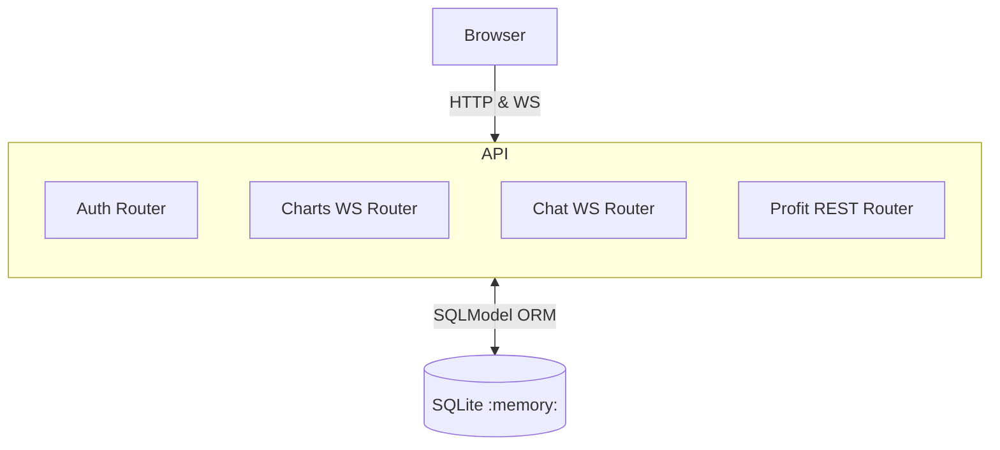

# Backend Plan for Finance-AI Mockup

## 1. Overview
This document outlines the architecture and implementation steps for the backend ( **be** ) of the Finance-AI mockup application.  The backend will be written in **FastAPI** and will run entirely in-memory using **SQLite** for persistence during the process lifetime.  All data is transient and is reset on each application start.

## 2. Technology Stack
* **Language**: Python 3.11+
* **Framework**: FastAPI
* **Web Server**: Uvicorn (ASGI)
* **Database**: SQLite ( `:memory:` ) via SQLModel / SQLAlchemy 2.0
* **Schema / Validation**: Pydantic v2
* **Auth**: JWT tokens with bcrypt password hashing
* **Real-time Transport**: WebSockets (native FastAPI implementation)
* **Test**: pytest & httpx
* **Lint / Style**: ruff, black
* **Security**: slowapi (rate limiting), python-jose (JWT), passlib (password hashing)

## 3. High-Level Architecture


### Component Responsibilities
1. **Auth Router**
   * POST `/auth/register` – creates new user accounts with validation.
   * POST `/auth/login` – validates credentials and returns JWT tokens.
   * POST `/auth/refresh` – refreshes access tokens using refresh tokens.
   * GET `/auth/me` – returns current user profile (protected route).
   * Users stored in `users` table (id, username, email, password_hash, full_name, created_at, is_active).
   * Passwords hashed with `bcrypt` using `passlib`.
   * JWT tokens with access (15 min) + refresh (7 days) expiration.
2. **Charts WS Router**
   * Endpoint: `ws://.../charts/{chart_type}` where `chart_type ∈ {line, pie, bar}`.
   * JWT token required via query parameter or header.
   * Client may send JSON `{ "interval_ms": 3000 }` to set custom push frequency.
   * Server streams randomly generated data arrays at requested interval (default 2000 ms).
3. **Chat WS Router**
   * Endpoint: `ws://.../chat`.
   * JWT token required for connection.
   * For each inbound user message, respond with generated *lorem ipsum* text of variable length (50-120 words) to mimic Gen-AI.
4. **Profit REST Router**
   * GET `/profits` returns paginated & filterable company-wise monthly profit table.
   * JWT token required (protected route).
   * Supports query params: `company`, `year`, `page`, `size`.
   * Data is pre-seeded on startup.

## 4. Database Schema (SQLModel)
```text
+---------------+----------------------+-----------+
| Table         | Columns              | Notes     |
+===============+======================+===========+
| users         | id PK                |
|               | username UNIQUE      |
|               | email UNIQUE         |
|               | password_hash        | bcrypt    |
|               | full_name            | optional  |
|               | created_at DATETIME  |
|               | is_active BOOLEAN    | default T |
+---------------+----------------------+-----------+
| refresh_tokens| id PK                |
|               | user_id FK           |
|               | token_hash           | hashed    |
|               | expires_at DATETIME  |
|               | created_at DATETIME  |
|               | is_revoked BOOLEAN   | default F |
+---------------+----------------------+-----------+
| profits       | id PK                |
|               | company              |
|               | year INT             |
|               | month INT (1-12)     |
|               | profit DECIMAL(12,2) |
+---------------+----------------------+-----------+
```

## 5. Pydantic Models

### Authentication Models
```python
# Request Models
class UserRegisterRequest(BaseModel):
    username: str = Field(min_length=3, max_length=30, pattern="^[a-zA-Z0-9_]+$")
    email: EmailStr
    password: str = Field(min_length=8, max_length=128)
    full_name: Optional[str] = Field(None, max_length=100)

class UserLoginRequest(BaseModel):
    username: str
    password: str

class TokenRefreshRequest(BaseModel):
    refresh_token: str

# Response Models
class UserOut(BaseModel):
    id: int
    username: str
    email: str
    full_name: Optional[str]
    created_at: datetime
    is_active: bool

class TokenResponse(BaseModel):
    access_token: str
    refresh_token: str
    token_type: str = "bearer"
    expires_in: int  # seconds

class UserProfileResponse(BaseModel):
    user: UserOut
```

### Other Models
* `ChartSubscribe` – incoming client config.
* `ChartData` – server push payload (timestamp + list of points / slices).
* `ChatMessageIn`, `ChatMessageOut`.
* `ProfitRecord` and `ProfitPage` (pagination wrapper).

## 6. Security Implementation

### Password Security
```python
from passlib.context import CryptContext
from passlib.hash import bcrypt

pwd_context = CryptContext(schemes=["bcrypt"], deprecated="auto")

# Password requirements (enforced via Pydantic validation)
# - Minimum 8 characters
# - At least one uppercase letter
# - At least one lowercase letter  
# - At least one number
# - At least one special character
PASSWORD_PATTERN = r"^(?=.*[a-z])(?=.*[A-Z])(?=.*\d)(?=.*[@$!%*?&])[A-Za-z\d@$!%*?&]"
```

### JWT Configuration
```python
# JWT Settings
SECRET_KEY = "your-secret-key-here"  # Use env var in production
ALGORITHM = "HS256"
ACCESS_TOKEN_EXPIRE_MINUTES = 15
REFRESH_TOKEN_EXPIRE_DAYS = 7

# Token payload structure
{
    "sub": "user_id",
    "username": "demo",
    "exp": timestamp,
    "iat": timestamp,
    "type": "access|refresh"
}
```

### Rate Limiting
```python
from slowapi import Limiter, _rate_limit_exceeded_handler
from slowapi.util import get_remote_address

limiter = Limiter(key_func=get_remote_address)

# Rate limits
# - Registration: 5 attempts per hour per IP
# - Login: 10 attempts per 15 minutes per IP
# - Token refresh: 20 attempts per hour per IP
```

### Input Validation & Sanitization
* Email format validation via `EmailStr`
* Username alphanumeric + underscore only
* Password strength requirements
* SQL injection prevention via SQLModel ORM
* XSS prevention via automatic Pydantic escaping
* Request size limits (max 1MB)

### Security Headers
```python
from fastapi.middleware.cors import CORSMiddleware
from fastapi.middleware.trustedhost import TrustedHostMiddleware

# Security middleware
app.add_middleware(TrustedHostMiddleware, allowed_hosts=["localhost", "127.0.0.1"])
app.add_middleware(
    CORSMiddleware,
    allow_origins=["http://localhost:3000"],  # Frontend URL
    allow_credentials=True,
    allow_methods=["GET", "POST"],
    allow_headers=["*"],
)
```

## 7. Authentication Flow

### Registration Flow
1. Client sends POST `/auth/register` with user data
2. Server validates input (email format, password strength, username uniqueness)
3. Rate limiting check (5 attempts/hour per IP)
4. Hash password with bcrypt
5. Store user in database
6. Return user profile (no tokens - require explicit login)

### Login Flow
1. Client sends POST `/auth/login` with credentials
2. Rate limiting check (10 attempts/15min per IP)
3. Validate username/email and password
4. Generate access token (15 min) and refresh token (7 days)
5. Store refresh token hash in database
6. Return both tokens to client

### Token Refresh Flow
1. Client sends POST `/auth/refresh` with refresh token
2. Validate refresh token (not expired, not revoked, exists in DB)
3. Generate new access token
4. Optionally rotate refresh token
5. Return new access token

### Protected Route Access
1. Client includes JWT in `Authorization: Bearer <token>` header
2. Server validates token (signature, expiration, format)
3. Extract user info from token payload
4. Proceed with request or return 401 if invalid

## 8. Startup Seed Routine
```python
async def seed_db(session):
    # Create demo user with secure password
    demo_pwd = pwd_context.hash("SecureDemo123!")
    session.add(User(
        username="demo", 
        email="demo@example.com",
        password_hash=demo_pwd,
        full_name="Demo User"
    ))

    # Insert synthetic profit data for 5 companies × 24 months
    for company in ("Alpha", "Beta", "Gamma", "Delta", "Epsilon"):
        for dt in pd.period_range("2022-01", "2023-12", freq="M"):
            session.add(Profit(
                company=company,
                year=dt.year,
                month=dt.month,
                profit=Decimal(random.uniform(50_000, 250_000)).quantize(Decimal("0.01")),
            ))
    await session.commit()
```

## 9. Security Considerations

### Production Security Checklist
- [ ] Use strong SECRET_KEY from environment variables
- [ ] Enable HTTPS/TLS in production
- [ ] Implement proper CORS policies
- [ ] Set secure cookie flags for session data
- [ ] Add request size limits
- [ ] Implement account lockout after failed attempts
- [ ] Add email verification for registration
- [ ] Log security events (failed logins, etc.)
- [ ] Regular token cleanup (expired refresh tokens)
- [ ] Input sanitization for all user data
- [ ] SQL injection prevention via ORM
- [ ] XSS prevention in responses

### Error Handling
* Generic error messages (avoid leaking user existence)
* Consistent response times (prevent timing attacks)
* Proper HTTP status codes (401 vs 403 usage)
* No sensitive data in error responses

## 10. Non-Functional Requirements
* Sub-100 ms latency for authentication endpoints
* Rate limiting to prevent brute force attacks
* Token validation overhead < 5ms
* 100% in-memory – zero external dependencies
* Hot-reload via `uvicorn --reload` during development

## 11. Assumptions & Open Questions
| # | Assumption | Rationale / Impact |
|---|------------|--------------------|
| A1 | Single-process ASGI server | simplifies in-memory DB; scale-out not required. |
| A2 | Data loss on restart is acceptable | demo / mockup nature. |
| A3 | Frontend handles chart rendering & interval selection | backend only streams raw data. |
| A4 | Chat responses do not require context memory | each response independent; simplifies implementation. |
| A5 | Profit data volume < 10 k rows | suitable for in-memory filtering. |
| A6 | JWT tokens stored client-side | acceptable for demo; consider httpOnly cookies for production. |
| A7 | No email verification required | simplifies demo registration flow. |
| A8 | Pydantic v2 available | enables `model_config` & validation improvements. |

## 12. Milestones / Tasks
1. Bootstrapping project (poetry/requirements, FastAPI skeleton).
2. Implement Database models & seed routine.
3. **Implement Auth router with registration, login, and JWT token management.**
4. **Add rate limiting and security middleware.**
5. Implement Chart WebSocket streaming with JWT auth.
6. Implement Chat WebSocket with JWT auth.
7. Implement Profit REST endpoint with pagination & filters (protected).
8. Write unit & integration tests for all auth flows.
9. Add security headers and error handling.
10. Add Dockerfile for containerized runtime (optional).

---
*Document version: 0.2 – updated with comprehensive authentication and security plan* 